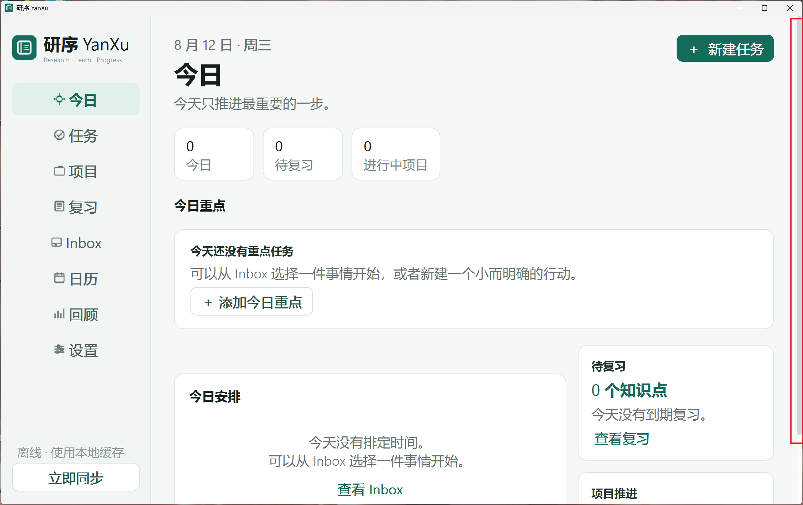

# YanXu

YanXu is a calm research, learning, and project workspace for graduate students and long-term learners. Windows and Android synchronize through the same Supabase account, while the mobile app also supports a two-person shared space.

[中文 README](README.md) · [Installation](docs/INSTALL_EN.md) · [Sync and updates](docs/SYNC_AND_UPDATE_EN.md) · [Contributing](CONTRIBUTING.md)

## Highlights

- Today dashboard, tasks, projects, spaced review, Inbox, calendar, focus sessions, and weekly review
- Account-based synchronization between Windows and Android
- Shared tasks/projects for two mobile members; private reviews, Inbox items, and focus sessions
- Offline cache and soft-delete synchronization
- One Supabase Storage `manifest.json` for desktop and Android updates
- SHA-256 verification before installation; a failed download never replaces the working app

## Stack

- Windows: Python, PyQt5, PyInstaller
- Android: TypeScript, Vite, Capacitor 7, and a native Java updater plugin
- Backend: Supabase Auth, Postgres, and Storage

The repository contains only public client code and migrations. Never commit a Supabase `service_role`/secret key, user token, Android signing keystore, or signing passwords.

## Quick start

1. Run `supabase/schema.sql`, `supabase/migrations/20260811_yanxu_v2.sql`, and `supabase/migrations/20260812_yanxu_releases.sql` in the Supabase SQL Editor.
2. Build or install the clients using the [installation guide](docs/INSTALL_EN.md).
3. Enter your Supabase Project URL and Publishable key in the app. Never use a `service_role` key in a client.
4. Build a release with `scripts/build_release.ps1`, then upload the packages and manifest with `scripts/publish_release.ps1`.

Current version: `2.2.0`.

> The one-time move from the old Android debug build to production v2.2.0 requires uninstalling the debug app after syncing. Subsequent production releases update in place.
