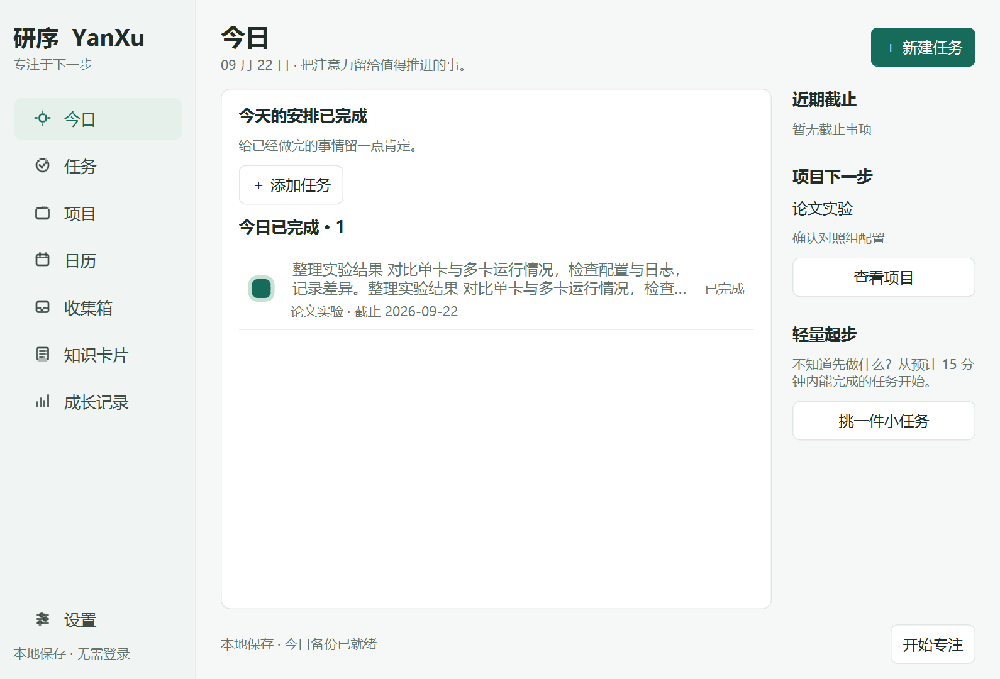
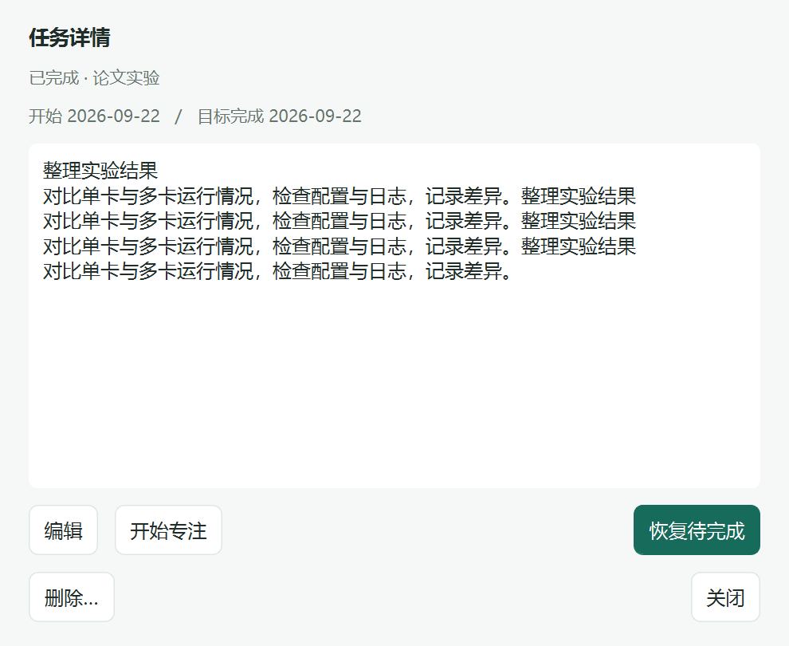
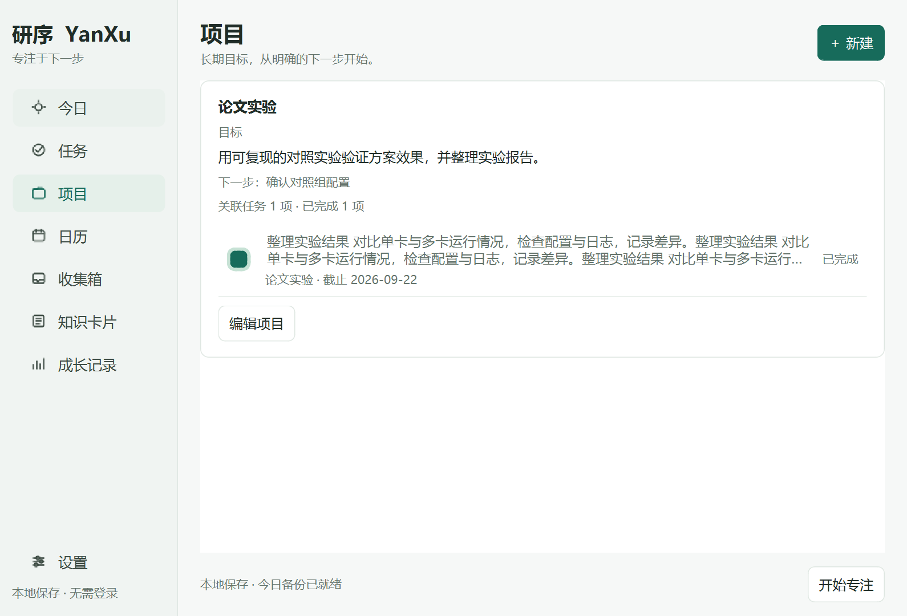
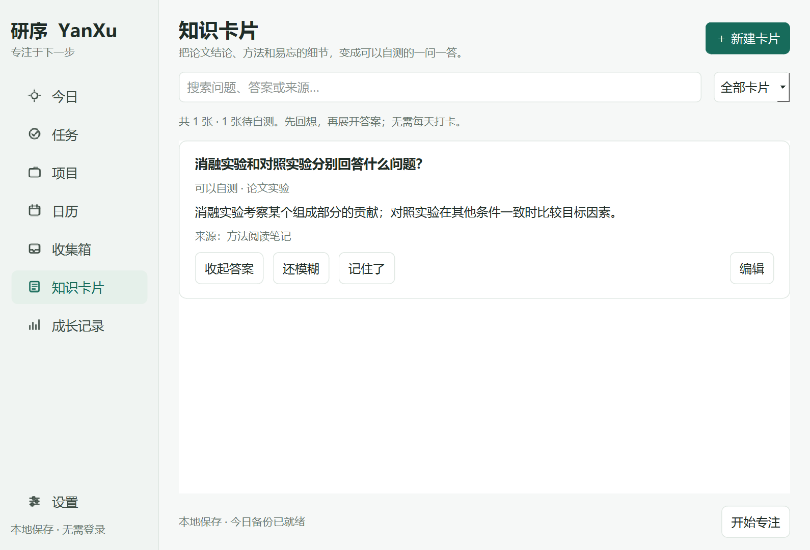
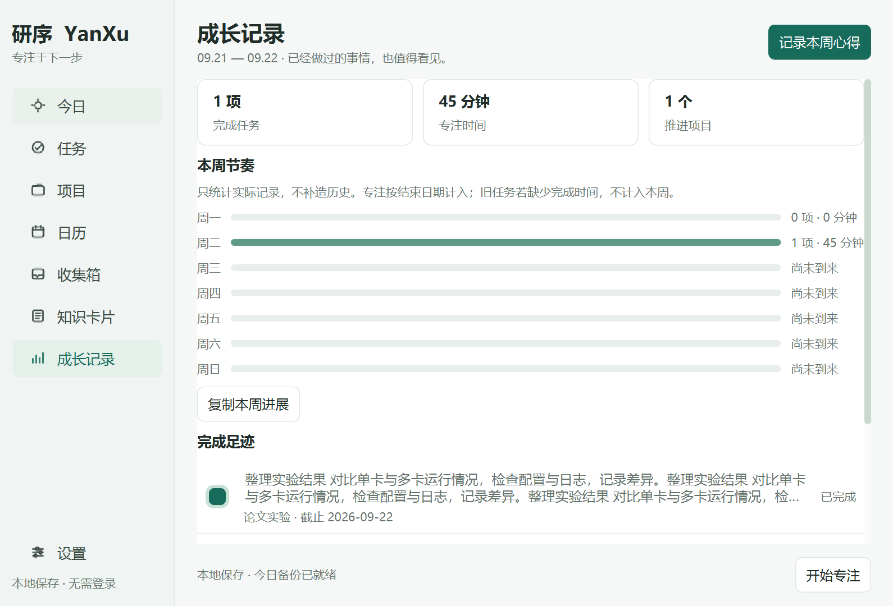

# YanXu

A calm personal workspace for research and learning. Keep tasks, project goals, knowledge cards and focus records together—and make the next step clear.

**Current development version: 2.3.1 desktop preview · Windows · Local-first · No login required.**

[中文](README.md) · [Installation](docs/INSTALL_EN.md) · [Desktop guide (Chinese)](docs/DESKTOP_LOCAL_CN.md) · [Changelog](CHANGELOG.md) · [Contributing](CONTRIBUTING.md)



## Features

- **Today and tasks:** start dates, target dates, completion and undo. Long content opens in a centered detail window without squeezing the dashboard.
- **Projects:** visible goals, next actions, related tasks and completion counts.
- **Knowledge cards:** questions, answers, sources and project links. Recall before revealing the answer, then schedule another self-test based on feedback.
- **Progress journal:** weekly completed tasks, focus time, reflections and a copyable weekly report.
- **Small start:** suggests an existing actionable task estimated at 15 minutes or less; never changes a task or starts a timer automatically.
- **Calendar, Inbox and focus:** date-based browsing, idea capture and conversion, start/pause/resume/finish timing.
- **Local data:** transactional SQLite writes, daily startup backups, export and restore. Legacy cache and records are preserved.

## Screenshots

Actual application renders with sample data only—no real account or user records.

### Task details



### Project goals



### Knowledge cards



### Progress journal



## Run the desktop app

Validated on Windows with Python 3.12 and PyQt5. From the repository root:

```powershell
python -m venv .venv
.\.venv\Scripts\Activate.ps1
python -m pip install -r requirements-desktop.txt
python yanxu_desktop.py
```

No Supabase account or Android toolchain is needed. Test and package:

```powershell
python -m unittest discover -s tests -v
python -m PyInstaller --distpath release-desktop --workpath build-desktop YanXuDesktop.spec
```

Run `release-desktop/YanXu/YanXu.exe`; retain its `_internal` directory. [GitHub Releases](https://github.com/yiyi64799-dev/YanXu/releases) may still contain older cross-device builds. Source and published binaries do not necessarily share the same version.

## Scope and compatibility

| Component | Status |
| --- | --- |
| New desktop entry | `yanxu_desktop.py`, local-first, no login |
| Legacy cross-device entry | `yanxu_v2_app.py`, retained for compatibility |
| Android and Supabase | Preserved in `mobile/` and `supabase/`; not upgraded in this iteration |
| Phone synchronization | **Disabled in the new desktop preview** |
| Automatic update installation | **Disabled in this preview** to avoid installing an older build |

Data lives in `%LOCALAPPDATA%\YanXu`. First launch backs up and imports the existing local cache without deleting account settings. It does not repeatedly overwrite the new database or download cloud-only records.

Reminders require the app to remain running; closing to the tray is optional. In-progress focus intervals are not yet recovered after a crash. Repeat rules are preserved but recurring tasks are not generated automatically.

## Source layout

```text
yanxu_desktop.py       Desktop pages and interactions
yanxu_widgets.py       Navigation and long-text controls
yanxu_store.py         Local storage, migration and backups
yanxu_insights.py      Weekly summaries, self-tests and small-task selection
tests/                Offline, restore, UI and summary tests
mobile/               Legacy Android client
supabase/             Legacy schema and migrations
```

Never commit accounts, user data, tokens, Supabase secret/service-role keys, signing files or build caches. Legacy behavior is documented separately in [Sync and updates](docs/SYNC_AND_UPDATE_EN.md).
